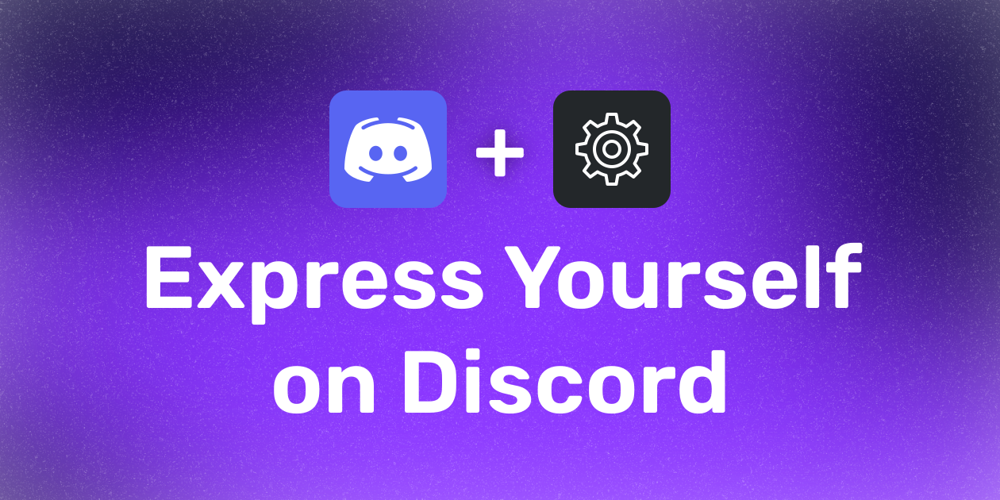
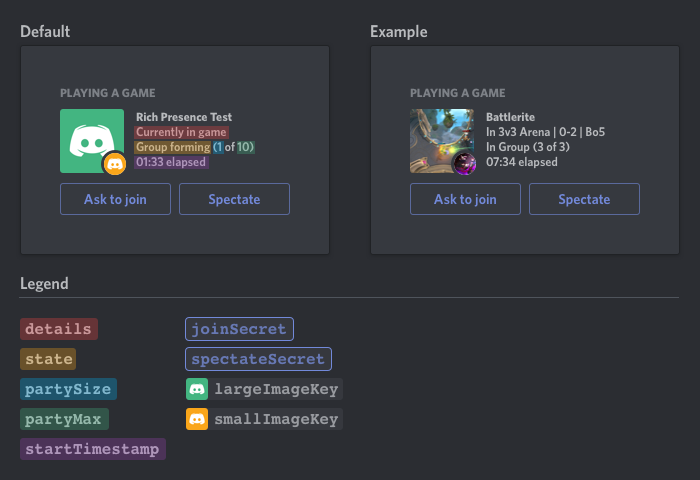

# Custom Discord Rich Presence - Express Yourself on Discord

> A simple Discord Rich Presence application that allows you to customize your Discord presence.



## Table of Contents

- [Introduction](#introduction)
- [Features](#features)
- [Getting Started](#getting-started)
    - [Installation](#installation)
    - [Step-by-Step Configuration](#step-by-step-configuration)
    - [Explanation of config.json for Custom Discord Rich Presence](#explanation-of-configjson-for-custom-discord-rich-presence)
        - [Configuration Elements](#configuration-elements)
        - [Timestamps Configuration in config.json](#timestamps-configuration-in-configjson)
            - [Timestamp Modes](#timestamp-modes)
            - [Additional Timestamp Settings](#additional-timestamp-settings)
        - [Finding Your Discord Application's Client ID](#finding-your-discord-applications-client-id)
        - [Element Positioning in Discord Rich Presence](#element-positioning-in-discord-rich-presence)
- [Conclusion](#conclusion)

## Introduction

Welcome to the Custom Discord Rich Presence project! This application is designed to enhance your Discord experience by
allowing you to personalize your presence status. It's perfect for gamers, streamers, or anyone who wants to showcase a
bit of their personality on Discord.

With our user-friendly setup, you can easily customize your Discord presence to display unique messages, images, and
links. Whether you're looking to share your current gaming activity, promote your latest stream, or simply add a
personal touch to your Discord profile, our application provides all the tools you need.

Read on to discover how you can get started with this exciting tool, configure it to suit your style, and make your
Discord presence stand out!

## Features

- 🎮 Customizable Discord Rich Presence
- 📝 All Fields are fully Customizable
- 🖼️ Configurable Large and Small Images
- 🔗 Interactive Buttons with Custom URLs
- ⏱️ Flexible Timestamps
- 👥 Party Feature with Size Display
- 🌐 Visibility Control for All Elements
- 🔄 Real-Time Status Update Capability
- 💻 Fully Customizable via JSON Configuration
- ✅ Configuration Validation for Enhanced User Experience
- 🛠️ Extensive Customization Options for Gamers and Streamers

## Getting Started

**Requirements:** [Node.js](https://nodejs.org/en/) (v20.10.0 or higher)

### Installation

1. **Clone the Repository**

   To clone the repository to your local machine, open your terminal and execute the following command:
    ```bash
    git clone https://github.com/smarterToby/discord-rich-presence.git
    ```
   Alternatively, you can download the repository as a ZIP file from the GitHub page.


2. **Clone the Repository**

   After cloning the repository or extracting the ZIP file, navigate to the project directory in your terminal. Install
   the required dependencies by running:
    ```bash
    npm install
    ```
3. **Start the Application**

   To start the application, run the following command:
    ```bash
    npm start
    ```
   The application will start running in your terminal. Make sure
   you [configure your Discord Rich Presence](#step-by-step-configuration)
   before starting the application.

    **Important:**
   - Restart the application after any changes to `config.json` to reflect updates.
   - Keep the terminal open to maintain the application's operation.
   - Discord must be running on your device to display your custom Rich Presence.


4. **Stop the Application**

   To stop the application, press `Ctrl + C` in your terminal or close the terminal window.

### Step-by-Step Configuration

1. **Create a Discord Application**

    - Go to the [Discord Developer Portal](https://discord.com/developers/applications).
    - Click on the 'New Application' button.
    - Name your application. This name will appear in your Discord status as 'Playing [Your Application Name]'.

2. **Upload Images for Rich Presence**

    - In your Discord application settings, navigate to the 'Rich Presence' tab.
    - Click on the 'Add Image(s)' button to upload your images.
    - These images will be used in your Discord presence:
        - The **Large Image Key** is for the primary, larger image display.
        - The **Small Image Key** is for a smaller, additional image, often used as an icon.

   More detailed instructions on how to use these images will be provided later.

3. **Edit the config.json File**

    - Locate the `config.json` file in your application directory.
    - Open the file in a text editor.
    - Start editing the file according to your preferences. See
      the [Configuration](#explanation-of-configjson-for-custom-discord-rich-presence) section for more
      information on how to configure your Discord Rich Presence.

### Explanation of config.json for Custom Discord Rich Presence

The `config.json` file is crucial for configuring your Discord Rich Presence. Here's a breakdown of each section and its
purpose:

#### Configuration Elements

1. **clientId**: Insert your Discord application's [Client ID](#finding-your-discord-applications-client-id) here.

2. **rich_presence**: This section contains all your Rich Presence settings.

    - **details**:
        - `text`: Text displayed in the details section of your presence.
        - `show`: Determines whether to show the details section (true/false).

    - **state**:
        - `text`: Text displayed in the state section of your presence.
        - `show`: Determines whether to show the state section (true/false).

    - **assets**:
        - **largeImage**:
            - `text`: Hover text for the large image.
            - `key`: Key for the large image uploaded to Discord. **(Must match the key of the image uploaded to
              Discord)**
            - `show`: Determines whether to show the large image (true/false).
        - **smallImage**:
            - `text`: Hover text for the small image.
            - `key`: Key for the small image uploaded to Discord. **(Must match the key of the image uploaded to
              Discord)**
            - `show`: Determines whet
                - `show`: Determines whether to show the small image (true/false).

    - **buttons**:
        - **primary** and **secondary**:
            - `labelText`: Text on the button.
            - `redirectUrl`: URL the button links to.
            - `show`: Determines whether to show the button (true/false).

    - **timestamps**:
        - `mode`: Mode of timestamps, e.g., 'remaining' or '
          elapsed'. [Explanation of modes](#timestamps-configuration-in-configjson).
        - `autoStart`: Automatically set the start timestamp to the current time (true/false).
        - `startTimestamp` and `endTimestamp`: Start and end timestamps in Unix time.
        - `show`: Determines whether to show timestamps (true/false).

    - **party**:
        - `id`: A unique ID for your party.
        - **size**:
            - `currentSize`: Current size of the party.
            - `maxSize`: Maximum size of the party.
        - `show`: Determines whether to show party information (true/false).

Each element allows you to tailor your Discord Rich Presence to your preference. You can add texts, configure images and
buttons, and control special features like timestamps and party information.

---

#### Timestamps Configuration in config.json

The `timestamps` section in the `config.json` file is used to control how time-related information is displayed in your
Discord Rich Presence.

##### Timestamp Modes

- **Elapsed**:
    - `mode`: When set to 'elapsed', the timestamp displays the duration since the `startTimestamp`. It effectively
      shows how much time has passed since a specific starting point.

- **Remaining**:
    - `mode`: If set to 'remaining', the timestamp counts down from the `endTimestamp`. This mode is used to indicate
      how much time is left until a specified ending point.

##### Additional Timestamp Settings

- `autoStart`: Set this to true if you want the start timestamp to automatically be set to the current time.
- `startTimestamp` and `endTimestamp`: These are the start and end points for your timer, set in Unix time format.
- `show`: Determines whether the timestamp is displayed in your Discord presence (true/false).

#### Finding Your Discord Application's Client ID

To connect your application with Discord, you'll need your unique `clientId`. Here's how to find it:

1. Visit the [Discord Developer Portal](https://discord.com/developers/applications).
2. Select your application or create a new one if you haven't already.
3. On the application's overview page, you will find the `clientId` in the OAuth2 section.
4. Click the copy button next to the `clientId` to copy it to your clipboard.

Once you have your `clientId`, insert it into the `clientId` field in your `config.json` file.

--- 

#### Element Positioning in Discord Rich Presence

The following image illustrates where each element is displayed in the Discord Rich Presence interface:



## Conclusion

I hope this guide has been helpful in setting up and customizing your Discord Rich Presence. With these instructions,
you can elevate your online presence on Discord, showcasing your unique style or brand. Whether you're a gamer, a
streamer, or just someone looking to add a personal touch to your Discord profile, this application is designed to be
flexible and user-friendly.

If you encounter any issues or have questions, I encourage you to open a new issue on
the [GitHub repository](https://github.com/smarterToby/discord-rich-presence/issues). Your
feedback and inquiries are important for continual improvement and support. Enjoy customizing your presence on Discord,
and I look forward to seeing your unique creations!
